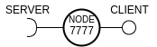
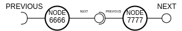
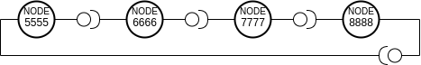

## Diagrams and Connections

### Node 

Each node is server and client itself. __Client__ is used to connect to other nodes and __Server__ is for receiving 
connection from other nodes. For example, Node A want to connect to Node B. In this case A's client will be connection 
to B's server.

Also, Client node is NEXT node and Server node is PREVIOUS node.

### Connection

When two nodes are connected, it means that, 6666's client connected to 7777's server. For 6666, node 7777 is NEXT node,
but for 7777, node 6666 is PREVIOUS node.

### Topology

The topology of network is RING.

For example network with 4 nodes looks like that:
